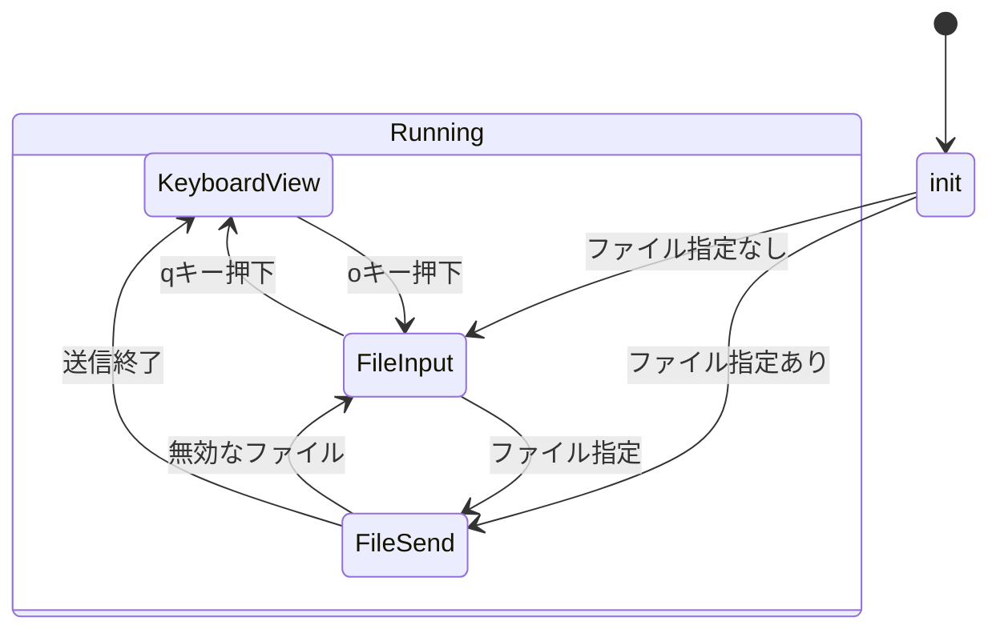

# FMプレイヤー (CLIモードのみ)

>[!NOTE]
> 現状、このプログラムはWindowsで実行することができない。
> 現在対応中である。

>[!TIP]
> * シリアル通信周りはかなり雑な実装なため、通信相手が実行中かつビジーでない状態でないとうまく動作しない。
> * 作りこみが甘い部分も多いので、好きなように拡張してください。


## 依存ツール

Linux(Debianベース)向けの依存ライブラリの導入について記載する

### Rust

一応公式ページを参照すること。

```sh
curl --proto '=https' --tlsv1.2 -sSf https://sh.rustup.rs | sh
```

## 実行方法

1. リポジトリのクローン
2. クローンしたディレクトリへ移動
3. ビルドと実行:`cargo run -r -- --port-name <port name>`
    * `<port name>`には、対象のシリアルポートを指定する。
    * `--port-name`ではなく、`-p 番号`でも指定可能番号は`--list`で表示される物
    * `-i filepath`で送信するファイルを直接指定することができる。

## MIDI 送信設定

MIDIファイルを送信する際、シーケンサが解釈できないメッセージを除去する機能を持つ。
有効化する場合は以下のオプションを設定すること。

|オプション|概要|
|:---|:----|
|ignore-text | テキスト関連のメッセージを除去する(送信量軽量化) |
|ignore-sysex | System Exclusiveメッセージを除去する |

指定可能なMIDIファイルはStandard MIDI Format1または0であり、
Format1のMIDIファイルは、送信前に自動的にFormat0へ変換する。
Format2のMIDIファイルには対応していない。~~Format2のデータって存在するの?~~

## 通信モード

Playerはシリアル通信モードとUDPによれ宇シリアル通信シミュレーションモードを備える。
シリアル通信で通信する場合は実行時にオプション`port-name`にポート名(e.g.`COM13`)またはデバイスファイルパス(e.g.`/dev/pts/6`)を指定すること。

UDP通信によるシリアルシミュレーションモードで実行する場合は、以下のオプションに適切に値を設定すること。
送信に関する情報が指定されている場合は、受信アドレスは自動的に設定され、UDP通信モードで動作する。

>[!TIP]
> UDPによる通信はV2のシーケンサのみ対応  
> V2でビルドスクリプトへ`--udp`を指定することで、UDPモードによる通信が可能になる。
> ただし、シリアル通信モードとは現状は板である。
> 詳細は[シーケンサV2 README]()を参照

|オプション名|概要|
|:---|:----|
|tx-addr | 送信先IPアドレス(必須) |
|tx-port | 送信先ポート番号(必須) |
|rx-addr | 受信IPアドレス(任意、デフォルト`0.0.0.0`) |
|rx-port | 受信ポート番号(任意、デフォルト`tx-port + 1`) |


## 動作状態

このプログラムは以下のような状態で動作する。


